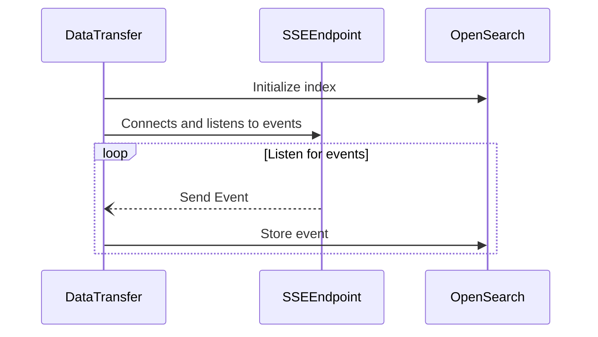

# Pillarbox Monitoring Transfer


Pillarbox Monitoring Transfer is a Kotlin-based Spring Boot service that connects to the Pillarbox
Monitoring Event Dispatcher SSE (Server-Sent Events) endpoint and publishes the received events to
an OpenSearch storage. This facilitates the collection and analysis of monitoring events from
clients, enabling data visualization and insights through tools like Grafana.

## Quick Guide

**Prerequisites and Requirements**

- **JDK 24** or higher
- **Docker** (optional)

**Setup**

1. Build the Application:
   ```bash
   ./gradlew clean build -x test
   ```

2. Run the Application:

- Using Gradle:
  ```bash
  ./gradlew bootRun
  ```
- Or, using the built JAR:
  ```bash
  java -jar build/libs/pillarbox-monitoring-transfer.jar
  ```

3. Configuration:
   The application can be configured using environment variables:
   ```bash
   export config__override__open-search__uri=http://opensearch:9200
   export config__override__dispatcher-client__uri=http://event-dispatcher:8080/events
   ```

**Running with Docker**

Alternatively, you can build and run the application using Docker:

1. Build the Docker Image:
   ```bash
   docker build -t pillarbox-monitoring-transfer .
   ```

2. Run the Docker Container:
   ```bash
   docker run -p 8081:8081 \
              -e config__override__open-search__uri=http://opensearch:9200 \
              -e config__override__dispatcher-client__uri=http://event-dispatcher:8080/events \
              pillarbox-monitoring-transfer
   ```

## Documentation

This project is a Kotlin-based Spring Boot application designed to connect to a Server-Sent Events (
SSE) endpoint, process incoming events, and store data in an OpenSearch index.

### System Flow Overview

The main loop of this service is illustrated in the following diagram:



### Session consolidation

Full session data is available on the `START` event, in order to attach it to subsequent events we
keep a fixed size in-memory [LRU Cache][lru-cache], events are resolved as follows:

- START events carrying the complete session payload is processed, we store that payload under
  its session ID and strip it out of the event, so downstream batches stay small.
- Non-START events look up their session ID in the cache and inherit the stored payload; any event
  whose session isn’t found is dropped.

### Key Components

Below is an overview of the most important classes that handle the core responsibilities of the
system:

- [PillarboxDataTransferApplication.kt][main-entry-point]: The main entry point of the application
  that bootstraps and configures the service.
- [OpenSearchSetupService.kt][setup-service]: Manages the initial setup of the OpenSearch index and
  the application’s configuration for SSE processing.
- [EventDispatcherClient.kt][sse-client]: Listens to the SSE endpoint, handling incoming events and
  managing retries in case of connection failures.
- [EventRequestDataConverter.kt][data-converter]: Enriches and transforms incoming events using
  registered data processors (e.g. user-agent resolution, error classification, etc.).

Here’s a more concise description of the GitHub Actions setup without listing the steps:

### Continuous Integration

This project automates its own development workflow using GitHub Actions:

1. **Quality Check for Pull Requests**
   Triggered on every pull request to the `main` branch, this workflow ensures the code passes
   static analysis and unit tests.

2. **Release Workflow**
   When changes are pushed to `main`, this workflow handles versioning and releases with
   `semantic-release`. It automatically bumps the version, generates release notes, creates a tag,
   and publishes a Docker image to Amazon ECR. This new version is automatically deployed to the
   development environment.

3. **Production deployment**
   To deploy a specific version to production, manually trigger the `Promote Version to Stable`
   workflow from the Actions tab, inputting the desired version number (e.g., 1.0.0). This workflow
   tags the selected version as stable in the ECR, and forces a new deployment on ECS.

## Contributing

Contributions are welcome! If you'd like to contribute, please follow the project's code style and
linting rules. Here are some commands to help you get started:

Check your code style:

```shell
./gradlew ktlintCheck
```

You can try an automatically apply the style by running:

```shell
./gradlew ktlintFormat
```

Detect potential issues:

```shell
./gradlew detekt
```

All commits must follow the [Conventional Commits](https://www.conventionalcommits.org/en/v1.0.0/)
format to ensure compatibility with our automated release system. A pre-commit hook is available to
validate commit messages.

You can set up hook to automate these checks before commiting and pushing your changes, to do so
update the Git hooks path:

```bash
git config core.hooksPath .githooks/
```

Refer to our [Contribution Guide](docs/CONTRIBUTING.md) for more detailed information.

## License

This project is licensed under the [MIT License](LICENSE).

[main-entry-point]: src/main/kotlin/ch/srgssr/pillarbox/monitoring/PillarboxDataTransferApplication.kt

[setup-service]: src/main/kotlin/ch/srgssr/pillarbox/monitoring/event/setup/OpenSearchSetupService.kt

[sse-client]: src/main/kotlin/ch/srgssr/pillarbox/monitoring/event/EventDispatcherClient.kt

[lru-cache]: src/main/kotlin/ch/srgssr/pillarbox/monitoring/cache/LRUCache.kt

[data-converter]: src/main/kotlin/ch/srgssr/pillarbox/monitoring/event/model/EventRequestDataConverter.kt

