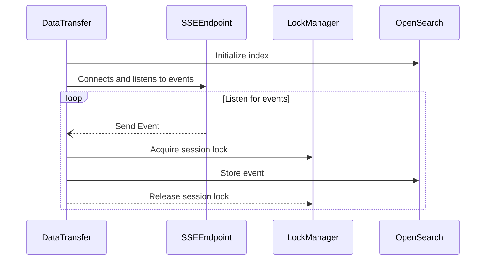

# Pillarbox Monitoring Transfer


Pillarbox Monitoring Transfer is a Kotlin-based Spring Boot service that connects to the Pillarbox
Monitoring Event Dispatcher SSE (Server-Sent Events) endpoint and publishes the received events to
an OpenSearch storage. This facilitates the collection and analysis of monitoring events from
clients, enabling data visualization and insights through tools like Grafana.

## Quick Guide

**Prerequisites and Requirements**

- **JDK 22** or higher
- **Docker** (optional)

**Setup**

1. Build the Application:
   ```bash
   ./gradlew clean build -x test
   ```

2. Run the Application:

- Using Gradle:
  ```bash
  ./gradlew bootRun
  ```
- Or, using the built JAR:
  ```bash
  java -jar build/libs/pillarbox-monitoring-transfer.jar
  ```

3. Configuration:
   The application can be configured using environment variables:
   ```bash
   export PILLARBOX_MONITORING_OPENSEARCH_URI=http://opensearch:9200
   export PILLARBOX_MONITORING_DISPATCH_URI=http://event-dispatcher:8080/events
   ```

**Running with Docker**

Alternatively, you can build and run the application using Docker:

1. Build the Docker Image:
   ```bash
   docker build -t pillarbox-monitoring-transfer .
   ```

2. Run the Docker Container:
   ```bash
   docker run -p 8081:8081 \
              -e PILLARBOX_MONITORING_OPENSEARCH_URI=http://opensearch:9200 \
              -e PILLARBOX_MONITORING_DISPATCH_URI=http://event-dispatcher:8080/events \
              pillarbox-monitoring-transfer
   ```

## Documentation

This project is a Kotlin-based Spring Boot application designed to connect to a Server-Sent Events (
SSE) endpoint, process incoming events, and store data in an OpenSearch index.

It leverages Spring Boot's reactive WebFlux framework and integrates custom health indicators using
Spring Boot Actuator to provide insights into application performance.

### System Flow Overview

The main loop of this service is illustrated in the following diagram:



### Key Components

Below is an overview of the most important classes that handle the core responsibilities of the
system:

- [PillarboxDataTransferApplication.kt][main-entry-point]: The main entry point of the application
  that bootstraps and configures the service.
- [BenchmarkHealthIndicator.kt][health-indicator]: Monitors the performance of key operations,
  providing real-time health metrics for the application.
- [LockManager.kt][lock-manager]: Ensures concurrency control by managing locks for different
  sessions, enabling thread-safe operations.
- [SetupService.kt][setup-service]: Manages the initial setup of the OpenSearch index and the
  application’s configuration for SSE processing.
- [SseClient.kt][sse-client]: Listens to the SSE endpoint, handling incoming events and managing
  retries in case of connection failures.

Here’s a more concise description of the GitHub Actions setup without listing the steps:

### Continuous Integration

This project automates its development workflow using GitHub Actions across three main workflows:
quality checks, releases, and deployments.

1. **Quality Check for Pull Requests**
   Triggered on every pull request to the `main` branch, this workflow ensures the code passes
   static analysis and unit tests. It guarantees that any new code meets quality standards before
   being merged into the main branch.

2. **Release Workflow**
   When changes are pushed to the `main` branch, this workflow handles versioning and releases using
   `semantic-release`. It automatically bumps the version, generates release notes, and pushes
   updates to the repository.

3. **Deployment Workflow**
   This workflow is triggered whenever a tag is created. It builds the Docker image for the service
   and pushes the image to an Amazon ECR repository.

## Contributing

Contributions are welcome! If you'd like to contribute, please follow the project's code style and
linting rules. Here are some commands to help you get started:

Check your code style:

```shell
./gradlew ktlintCheck
```

You can try an automatically apply the style by running:

```shell
./gradlew ktlintFormat
```

Detect potential issues:

```shell
./gradlew detekt
```

All commits must follow the [Conventional Commits](https://www.conventionalcommits.org/en/v1.0.0/)
format to ensure compatibility with our automated release system. A pre-commit hook is available to
validate commit messages.

You can set up hook to automate these checks before commiting and pushing your changes, to do so
update the Git hooks path:

```bash
git config core.hooksPath .githooks/
```

Refer to our [Contribution Guide](docs/CONTRIBUTING.md) for more detailed information.

## License

This project is licensed under the [MIT License](LICENSE).

[main-entry-point]: src/main/kotlin/ch/srgssr/pillarbox/monitoring/PillarboxDataTransferApplication.kt
[health-indicator]: src/main/kotlin/ch/srgssr/pillarbox/monitoring/health/BenchmarkHealthIndicator.kt
[lock-manager]: src/main/kotlin/ch/srgssr/pillarbox/monitoring/concurrent/LockManager.kt
[setup-service]: src/main/kotlin/ch/srgssr/pillarbox/monitoring/event/SetupService.kt
[sse-client]: src/main/kotlin/ch/srgssr/pillarbox/monitoring/event/SseClient.kt
